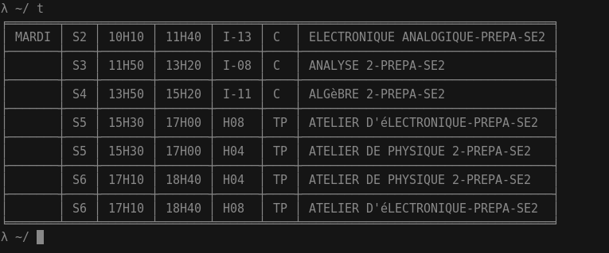

# ISSAT Time table

## Installing the code

So first clone the repo

	$ git clone https://github.com/mohamed-aziz/issat-timetable.git

My advice is to create a virtual environment using the virtualenv program, though you can skip this step:

	$ virtualenv timetable
	$ source timetable/bin/activate

If you create the virtualenv please set the TB_VENV_PATH environment variable, so that you won't need to worry about working on your venv every time (ideally set this in your .bashrc, .zshrc or whatever)

	(venv) $ export TB_VENV_PATH='<yourvenvpath>/bin/activate_this.py'

Then you can install the code requirements:

	(venv) $ pip install -r requirements_dev.txt

## Web API

**Note:** I no longer operate http://uspace.aziz.tn/ so just run your own server, you need redis installed.

I wrote a web API for people to use in their projects, it's up [here](http://uspace.aziz.tn/issatso/)
you can use it for free though I don't guarantee the stability of the server.

The API is documented in index.html, though I suggest reading the code which
won't be much of a challenge because Python WSGI is fucking poetry, anyways
if you want to run the code on your own I suggest
using gunicorn to deploy it (memory wise it is one of the best python wsgi server).

To run the web application using gunicorn:

    (venv) $ gunicorn -b 127.0.0.1:8000 webapp:app

The api internally uses redis which means that it's thread safe (it wasn't always like this
with previous versions of this code), so this means that you can specify
how many workers you want to create using the <code>--workers</code> argument.

for example:

    (venv) $ gunicorn -b 127.0.0.1:8000  --workers 4 webapp:app

This will create 4 instances of the application, that can coexist together since which will
produce in a gain of performance mainly.

You can then make requests like:

    http://localhost:8000/groupes

To get the lookup table,

    http://localhost:8000/groupes/M3ZiMjQxMTk=

To get the timetable for a certain group, also you can get the timetable for a subgroup using

    http://localhost:8000/groupes/M3ZiMjQxMTk=?groupe=2

Sadly there is no unit tests till now.

## Terminal application

**This only supports python3 due to the ugly virtualenv hack.**

This is a scrot:

Just run your issatso.py file;

To list all the groups:

	$ python3 issatso.py lsgroups

To get your week timetable:

	$ python3 issatso.py lstable "Your group"

You can use commands like:

	$ python3 issatso.py lstable "Your group" --today
	$ python3 issatso.py lstable "Your group" --day vendredi
    $ python3 issatso.py lstable "Your group" --subgroup 2

You can also get the cached data using the <code>--cached</code> paramater.

Tired of typing all that, alias it :)

	alias t='python3 ~/Projects/issatso/issatso.py lstable "Your group" --today --cached'

just put that in your .bashrc or .zshrc or whatever.

To output your data into json so that you can use the output in other programs, just use <code>--json</code> flag.

I will write an emacs plugin when I have time for this.
